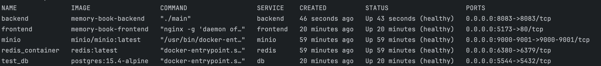
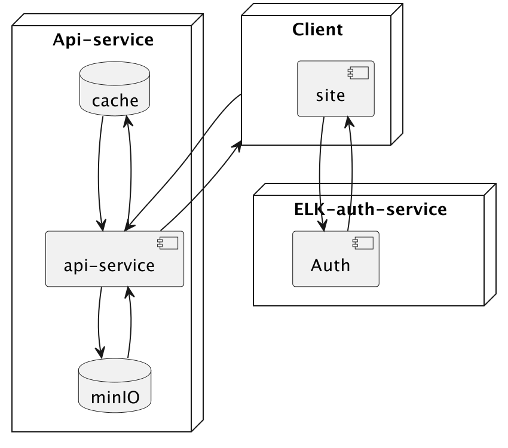

## Для запуска приложения используйте следующую команду:

```bash
docker-compose up -d --build
```

После успешного выполнения этой команды приложение будет доступно по адресу: [localhost:5173](http://127.0.0.1:5173/)

Документация API для фронтенда находится по адресу: [Swagger](http://127.0.0.1:8083/swagger/)

Админ-панель находится здесь: [Admin](http://127.0.0.1:5173/admin/dashboard/)

В докере для каждого сервиса реализована проверка доступности: healthCheck:



Схема взаимодействия сервиса:


